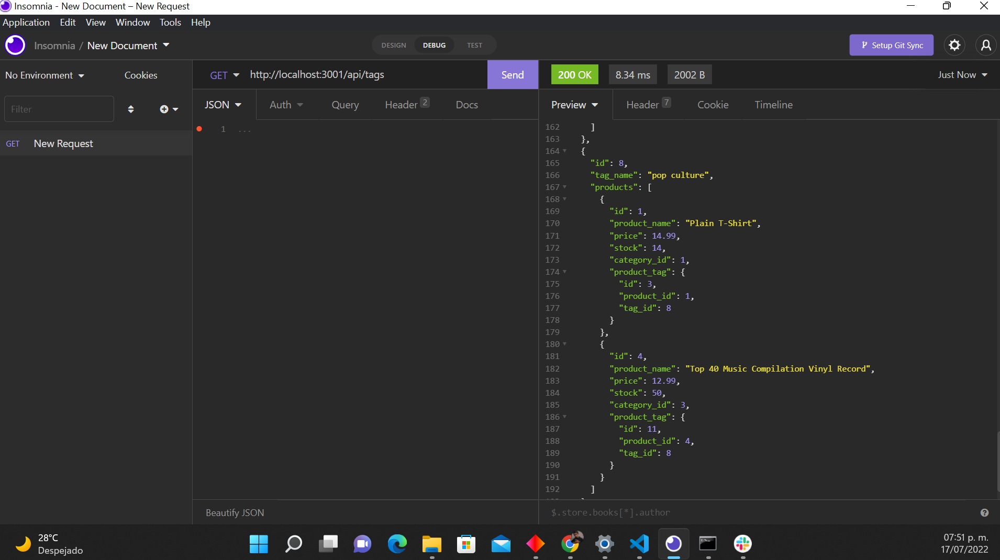
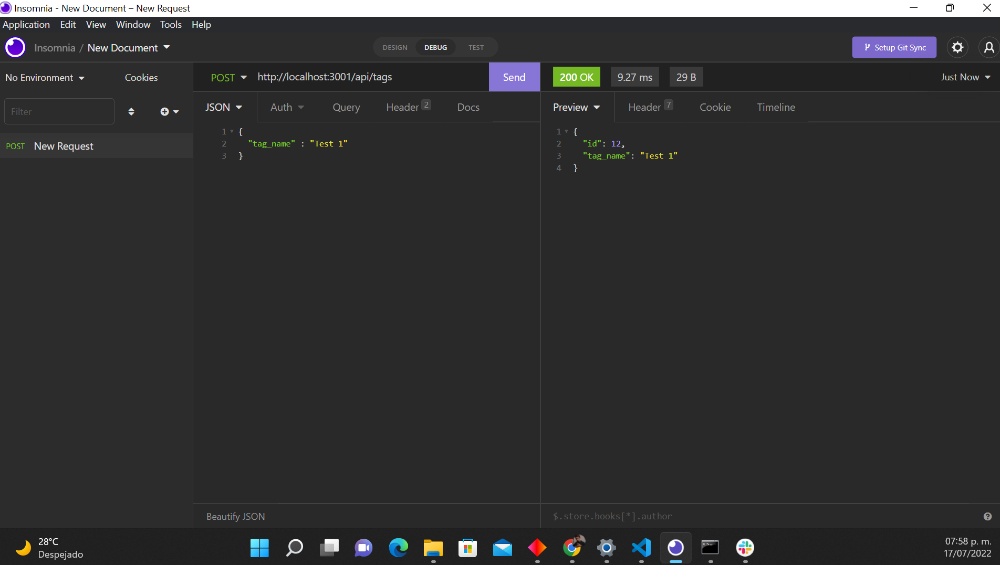
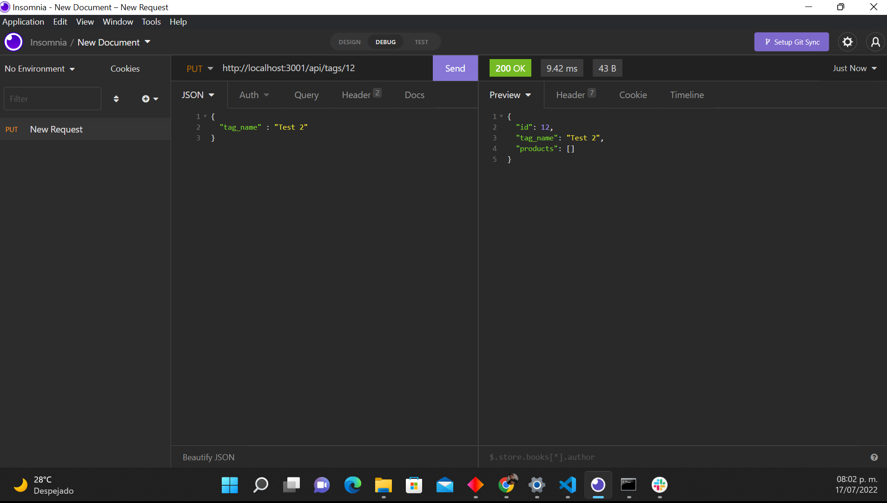
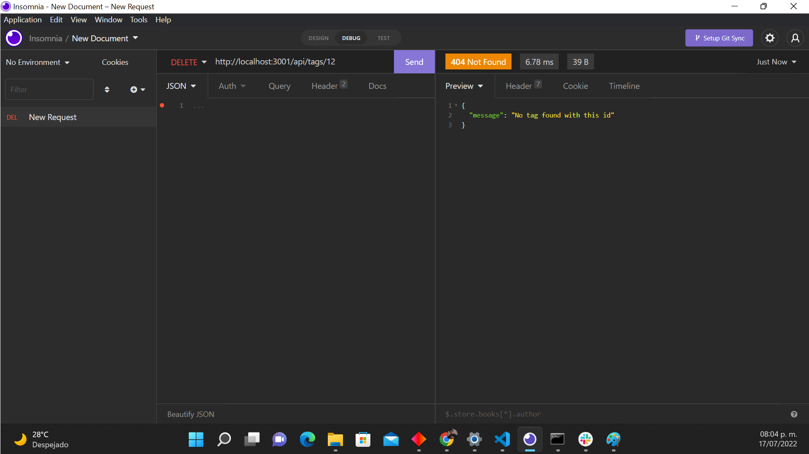

# Object-Relational Mapping (ORM): E-commerce Back End

[](https://github.com/israel2800)
[](https://github.com/israel2800/orm-e-commerce-challenge)
[](https://github.com/israel2800/orm-e-commerce-challenge)
[](https://nodejs.org/en/)
[](https://www.npmjs.com/package/inquirer)
[](https://choosealicense.com/licenses/mit/)

## Table of Content
* [ Project Links ](#Project-Links)
* [ Screenshots-Demo ](#Screenshots)
* [ Project Objective ](#Project-Objective)
* [ User Story ](#User-Story)
* [ Technologies ](#Technologies)
* [ Installation ](#Installation)
* [ Usage ](#Usage)
* [ Credits and Reference ](#Credits-and-Reference)
* [ Tests ](#Tests)
* [ Author Contact ](#Author-Contact)
* [ License ](#License)
#

##  Project Links
YouTube video Demo:
https://youtu.be/jCQ82QOkkbE

GitHub project:
https://github.com/Israel2800/orm-e-commerce-backend

## Screenshots-Demo

Testing GET method with Insomnia

Testing POST method with Insomnia

Testing PUT method with Insomnia

Testing DELETE method with Insomnia



## Project Objective
Create a back end for an e-commerce website that allows the company to add, upgrade and delete specific information they decide to use, making them more competitive with other e-commerce companies.

## User Story
AS A manager at an internet retail company, I WANT a back end for my e-commerce website that uses the latest technologies, SO THAT my company can compete with other e-commerce companies.

## Technologies 
```
node.js, npm, express, JavaScript, mysql2
```

## Installation
Access to the GitHub project and clone or download the project, you can do this by clicking in the green button with the word "Code". If you decided to clone the repo you need to choose one of the SSH/HTTPS keys and copy one, after this you will need to open the terminal of your choice and type "git clone 'key'" you will need to paste one of the two keys you previously select and then click enter. If you decided to download the project you will click in the "Download.zip" option and the project will be downloaded so you will locate the file and do a right-click to select "Extract All" and you can choose where tu place it.

## Usage 
To use this app you will need to download and install the terminal for mac or gitbash for windows and also [insomnia](https://insomnia.rest/download) to GET, POST, PUT and DELETE specific information to the database and [mysql](https://dev.mysql.com/downloads/windows/installer/8.0.html) to a correctly installation for the project. You may also need to install [node.js](https://nodejs.org/en/) and [npm](https://www.npmjs.com/) using the terminal. You will open the project in the code editor of your choice and then open the terminal and type "npm install" or "npm i" to install all the dependencies required. It will be necessary to create a file called ".env" with the following information: 
"DB_NAME='ecommerce_db'
DB_USER='root'
DB_PW='(your password)'" 
After that is created we are able to run the schema.sql file, for this is necessary to type in the terminal "mysql -u root -p" and then introduce your password, with that done we can type "source db/schema.sql;" and then we are good to quit it typing "quit;". The next step is typing into the terminal "npm run seed" and finally you will be able to start the project typing "npm start" or "node server.js" on your terminal or gitbash. In insomnia you will type "http://localhost:3001/api/ (categories, products or tags)" and choose a method to do a test.

## Credits and Reference
The following link helped me with the project: https://github.com/sidorares/node-mysql2

## Tests
npm test

## Author Contact
Contact the author with any questions!<br>
Github link: [Israel2800](https://github.com/israel2800)<br>
Email: dady281100@gmail.com

## License
This project is [MIT](https://choosealicense.com/licenses/mit/) licensed.<br />

Copyright © 2022 [ISRAEL AGUILAR](https://github.com/israel2800)

<hr>
<p align='center'><i>
This README was generated with ❤️ by ISRAEL AGUILAR
</i></p>
